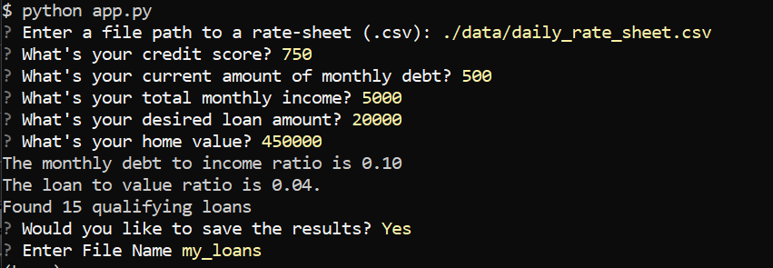
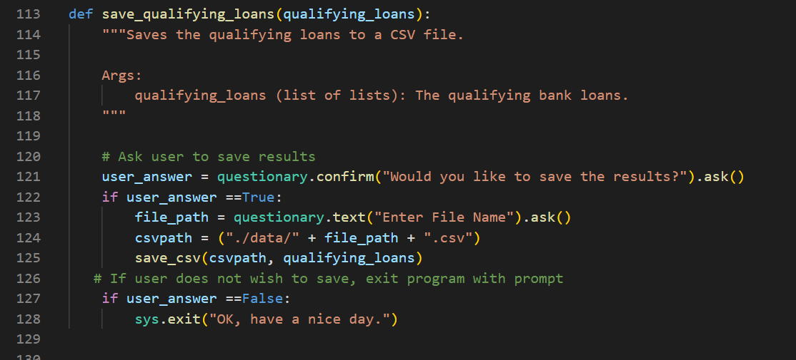

# Loan Qualiferier App
The purpose of this app is allow the user to easily see if they qualify for a loan based on information they provide.  That information will be cross referenced with our database of participating banks and their requirements for underwriting a loan.

---

## Technologies
This project was created with python v3.9.12.  It also uses the packages fire and questionary.

[fire](https://google.github.io/python-fire/guide/) provides assistance with loading modules and calculators.

[questionary](https://pypi.org/project/questionary/) improves the user experience by allowing dialogue.

Created on Windows 10

---

## Installation Guide

Be sure to have python, fire, and questionary installed before running the data.  To download Python, visit (https://www.python.org/downloads/).  Fire and questionary can be installed in the terminal with the commands "pip install fire" and "pip install questionary".  Failure to do so will result in an error.  

---

## Usage
To use this program, download the project2 file from the repository at (https://github.com/jeffreycrabill/project2), and run app.py in your bash terminal.  To access the bank data, type "./data/daily_rate_sheet.csv" when prompted.  The information provided will determine if there is an applicable loan.  If that is the case, you will be able to save the results.  

---

## Contributors
Created by Jeffrey Crabill
jeffreycrabill@gmail.com
(twitter.com/jeffcrabill)
(linkedin.com/jeffreycrabill)

---

## License

This code is property of Jeffrey Crabill.  All rights reserved.  Duplicating any section of this code without the express written consent of Jeffrey Crabill or any of our affiliates is strictly prohibited.